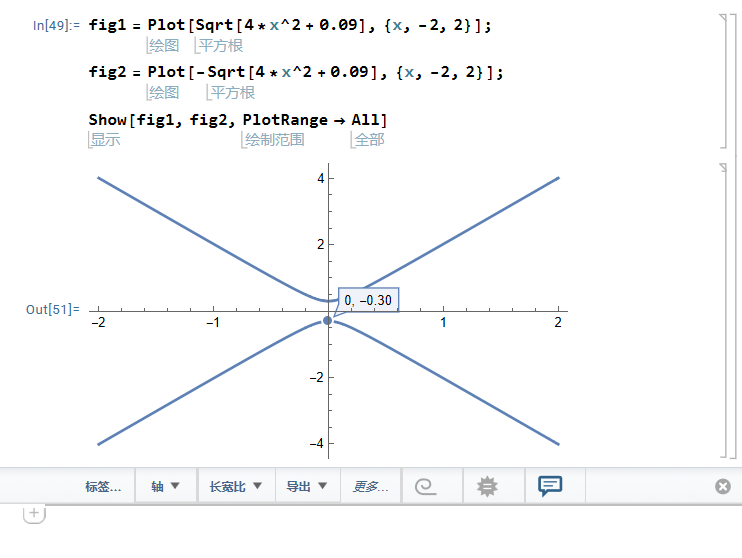

## 文献阅读

文献：[Kane和Mele - 2005 - Quantum Spin Hall Effect in Graphene.pdf](assets/Kane和Mele%20-%202005%20-%20Quantum%20Spin%20Hall%20Effect%20in%20Graphene-20241210145857-fujqh8z.pdf)

起因：英文文献逐字逐句读完之后没有留下印象，第二天再打开就不知道讲了一些什么，因此把阅读的感想记录一下。

---

## 摘要：

* 我们研究了自旋轨道相互作用对于单平面石墨烯的低能电子结构的影响。

* 我们发现在实验可触及的低温条件下，对称性允许的自旋轨道势能将石墨烯从一个理想的二维半金属态转换为一个量子自旋霍尔绝缘体。

  * 这种非平常的物质电子态在体中是有能隙的，并且支持在在样品边界的无带隙的边缘态的自旋和电荷的传输。边缘态是非手性的，但是他们对于无序是不敏感的，因为他们的方向性是和自旋相关的。

* 本文计算了自旋和电荷在边缘态的电导，讨论了温度、化学式、rashba耦合、无序和对称性破缺场。

## 正文：

* 本文我们展示了在**充分低的能量下**，单层石墨烯具有由自旋轨道相互作用产生的能隙导致的量子自旋霍尔效应。我们的动机有两部分。

  * ~~首先，Novoselov等人最近报道了单层石墨烯薄膜的制备过程。这些薄膜展示了预期的门控双极性行为，并且具有最高~~​~~$10^4cm^2/Vs$~~​~~的迁移率。因此对石墨烯单层的详细的实验研究现在看来是可行的。我们相信石墨烯单层中的量子自旋霍尔效应在实验可达到的低温下可以观测到。~~
  * 其次，我们将会展示石墨烯单层中的量子自旋霍尔效应与其他三维立方系统中研究过的自旋霍尔效应不同。因为石墨烯单层中的量子自旋霍尔效应会产生一个与能带绝缘体在拓扑上不同的相。这可能会其他二维自旋霍尔绝缘体材料的研究或者具有层内强自旋轨道相互作用的材料提供一个起点。

> **充分低的能量**：
>
> 因为室温只有26meV，相比费米面的温度充分低，所以在讨论时考虑充分低的能量
{: .block-tip }

!!! Note
    **充分低的能量**：  
    因为室温只有26meV，相比费米面的温度充分低，所以在讨论时考虑充分低的能量

~~石墨中的自旋轨道相互作用已经被认识了超过40年，并且在在石墨的费米面少数空穴的形成中发挥作用。然而这些效应因为被认为非常小而在很大程度上被忽视并被更大的石墨烯平面之间的耦合掩盖。与拥有有限的费米面的石墨不同，石墨烯单层处于一个可以被低能的小围绕强烈影响的临界的电子态。~~

‍由于石墨单层没有**层间耦合**，所以能够反映出微弱的、以前被忽略的自旋轨道耦合的效应。

石墨烯由包含两个碳原子的子晶格的蜂窝晶格组成。这些靠近费米能量的态是位于六边形布里渊区对角的 K 和 K' 点附近的$\pi $轨道。通过写出低能电子波函数，有效质量模型可以如下写出

$$
\boldsymbol{\Psi(r)}=[(u_{AK},u_{BK}),(u_{AK'},u_{BK'})]\cdot\psi(r) \tag{1}
$$

> **Q:什么是K点附近的$\pi$轨道？**  
> 待解决
{: .block-tip}

这里的$u_{(A,B)(K,K')}(r) $描述了位于$A,B $子晶格上的动量$k=K,K'$的基态。$\psi(r)$是包含四个分量的缓慢变化的包络函数。有效质量哈密顿量可以写成一下形式：

$$
\mathcal{H}_0=-i\hbar v_F\psi^{\dagger}(\sigma _x \tau_z\partial_x+\sigma _y\partial_y)\psi \tag{2}
$$

> **包络函数**：
> 
>  $$
>   \Psi_n(\boldsymbol{r},t)=\frac{sin\Delta k[\boldsymbol{r}-\boldsymbol{r_c}-\boldsymbol{\nu_n(k_c)}t]/2}{\Delta k[\boldsymbol{r}-\boldsymbol{r_c}-\boldsymbol{\nu_n(k_c)}t]/2}
 >   $$
> * 晶体中的布洛赫电子波包可以分成两部分的乘积，一部分是波包中心$k_c $处的Bloch函数，另一部分是包络函数
> * 包络函数描述波包
> * 晶格周期函数描述周期势的作用
{: .block-tip}

这里的$\vec{\sigma } $和$\vec{\tau} $是$\sigma_z=\pm1$的泡利矩阵，他们描述在$A(B)$子晶格的量子态。$\tau_z=\pm 1$描述在$K(K')$处的量子态。这个哈密顿量描述$E(q)=\pm v_F \|q\|$的没有带隙的量子态。在没有自旋的时候，$\boldsymbol{q}=0$处的退化是受对称性保护的。唯一有可能添加后会打开能带的项就是$\sigma_z$或$\sigma_z \tau_z$的比例（？）与交错子晶格势能对应的$\sigma_z$项在手性对称性下是奇数的（交换$A,B$子晶格）。$\sigma_z \tau_z$项在手性下是偶数的但是在时间反演对称形下是奇数的（交换$K,K'$）。

‍

自旋轨道相互作用允许有一个新的项，而这个就是本文研究的重点。

$$
\mathcal{H}_{SO}=\Delta_{SO}\psi^{\dagger}\sigma_z \tau_z s_z\psi\tag{3}
$$

这里的$s_z$是代表电子自旋的泡利矩阵。这一项遵从石墨烯的所有对称性并体现对称性。接下来我们将会明确地从微观的自旋轨道相互作用构建这一项并估算它的大小。如果关于平面的镜面对称被保留，那么这是在$q=0$时唯一被允许的自旋独立项。如果镜面对称被打破，那么$(s\times p)\cdot \hat{z}$形式的Rashba项被允许

$$
\mathcal{H}_R=\lambda_R\psi^{\dagger}(\sigma_x\tau_zs_y-\sigma_ys_x)\psi\tag{4}
$$

对于$\lambda _R=0$，$\Delta_{SO}$产生一个拥有$2\Delta_{SO}$（上下分别距离坐标轴$\Delta_{SO}$）能隙的$E(q)=\pm\sqrt{(\hbar v_Fq)^2+\Delta_{SO}^2}$的色散关系。【色散关系怎么算出来的】

对于$0<\lambda_R<\Delta_{SO}$，能隙$2(\Delta_{SO}-\lambda_R) $保持有限。

对于$\lambda_R>\Delta_{SO}$，能隙关闭，电子结构为无带隙半导体的二次色散能带（？）

在下文的讨论中我们假设$\lambda_R<\Delta_{SO}$并且分析这个导致的有能隙的相的属性。文末通过数值估算给出了这一假设的合理性。

​​

由$\sigma_z\tau_zs_z$产生的带隙与$\sigma_z$或$\sigma_zs_z$的交错子晶格势能产生的能隙不同。

后一项中的基态在强耦合时与简单绝缘项绝热连接的，两个子晶格是解耦的。【？】与之相比，$\sigma_z\tau_zs_z$所产生的能带在$K，K'$处是反号的。这没有简单的强耦合极限。为了平滑连接$\sigma_z$和$\sigma_z\tau_zs_z $所产生的态，必须经过一个能隙消失的临界点，将具有不同拓扑序的态分开。

自旋轨道耦合项作为一个对于（2+1）维的相对论性的场论中的奇偶异常【？】的认识，与Haldane模型相关。分开说，$s_z=\pm1$的自旋的哈密顿量违反了时间反演对称性并且与haldane的无自旋电子模型等效。这个哈密顿量可以使用引入没有净通量的周期性磁场实现。就像haldane展示的，这引起了一个在$K$和$K'$处反号的$\sigma_z\tau_z$的能隙。在能量远低于能隙处，这一项导致了一个量子化的霍尔电导$\sigma_{xy}=\pm e^2/h$.这个由Kubo公式计算得到的霍尔电导可以被解释为动量空间的贝里曲率引起的拓扑陈数。因此，对于不同的自旋，自旋轨道耦合项中能隙处的符号是相反的。一个电场会对相反的自旋产生相反的电流，导致自旋电流$J_s=(\hbar / 2e)(J_\uparrow-J_\downarrow)$，由量子自旋霍尔电导为特征【？】（表现为量子自旋霍尔电导）

$$
\sigma_{xy}^s=\frac{e}{2\pi}\tag{5}
$$

因为自旋电流在实验观测中不耦合，所以很难直接观测到自旋霍尔电导.

在量子霍尔效应，体拓扑序要求没有能隙的边缘态。我们现在展示石墨烯中也存在没有能隙的边缘态。我们将会从建立$\lambda_R=0$的边缘态开始。我们之后会讨论无能隙的边缘态在$\lambda_R \ne 0$的时候仍然保持。他们对于若电子相互作用和无序具有很强的抵抗力。因此，尽管无能隙边缘态的违反标志了一个与普通绝缘体不同的状态。这个量子自旋霍尔效应态不同于参考文献5中的绝缘体。它也不同于掺杂GaAs中的没有能隙的自旋霍尔效应。

对于$\lambda_{R}=0$，哈密顿量的第二、三项保持$s_z$【？】，行窃这个无能隙的边缘态遵循Laughlin的讨论。考虑一个很大的圆柱（大于$\hbar v_F\Delta_{SO }$）然后绝热地从底部插入量子 相位$\phi=h/e$的磁通量子（比$\Delta_{SO}/\hbar$慢）。这样产生的方位角法拉第电场会诱导一个自旋电流，所以自旋可以$\hbar$从圆柱体的一段传输到另一端。因为磁场中的方位角变化不能激发粒子跨越能隙$\Delta_{SO}$，所以两端的能态必须是无能隙的来容纳额外的自旋【什么是额外的自旋？】

一个对边缘态的明确的描述需要一个能够给出整个布里渊区的能带的模型。跟随haldane模型，我们引入了次临近的紧束缚模型。

$$
\mathcal{H}=\sum_{<ij>\alpha}tc_{i\alpha}^\dagger c_{j\alpha}+\sum_{<<ij>>\alpha \beta}it_2v_{ij}s_{\alpha \beta}^zc_{i\alpha}^\dagger c_{j\alpha} \tag{6}
$$

其中的第一项是通常的最近邻跃迁项。第二项使用自旋相关的振幅将次近邻的原子连接起来。$v_{ij}=-i_{ji}=\pm1$，依赖两个最近邻的键$\boldsymbol{d_1}$和$\boldsymbol{d_2}$中电子从$j$到$i$的方向【？】如果电子向左侧（右侧）移动进入次近邻键，则$v_{ij}=\pm1$.自旋依赖的项像这样$i(d_1\times d_2) \cdot s$可以写成独立坐标的形式。在低能情况下（5）式减为（2,3），$\Delta_{SO}=3\sqrt{3}t_2$。

边缘态可以通过在条带几何下求解（7）式看到。图1展示了在石墨烯zigzag边缘方向上的一维条带型的能带。K,K'处一维投影处的体能隙清晰可见。此外，两个能带穿过能隙，将K和K'连接起来。这些你呢带局域在条带的边界，每个能带在每个边界退化【？】边缘态不是手性的因为每个边界都有在各个方向传播的态【？】然而就像图2中描述的一样，边缘态都是自旋过滤的，即具有相反自旋的电子沿相反方向传播。相似的边缘态在armchair边缘也存在。尽管在这种情况下K和K'的一维投影都在$k=0$处。有趣的是，zigzag边缘态中保持$\Delta_{SO}\rightarrow0$，他们变得完美地平坦

‍

## 待删除

<del>固态系统中的自旋电流产生一直是最近强烈关注的焦点。掺杂半导体中的自旋轨道相互作用导致自旋霍尔效应的产生已经被讨论过了，其中的自旋电流沿与施加的电场垂直的方向流动。自旋霍尔效应已经在GaAs中被观测到。 Murakami等人已经证实了一类正方材料是绝缘体，但是仍表现出有限的自旋霍尔导电性。这一类自旋霍尔绝缘体有本征的兴趣，因为它使得自旋电流在没有耗散的情况下产生。</del>
‍
